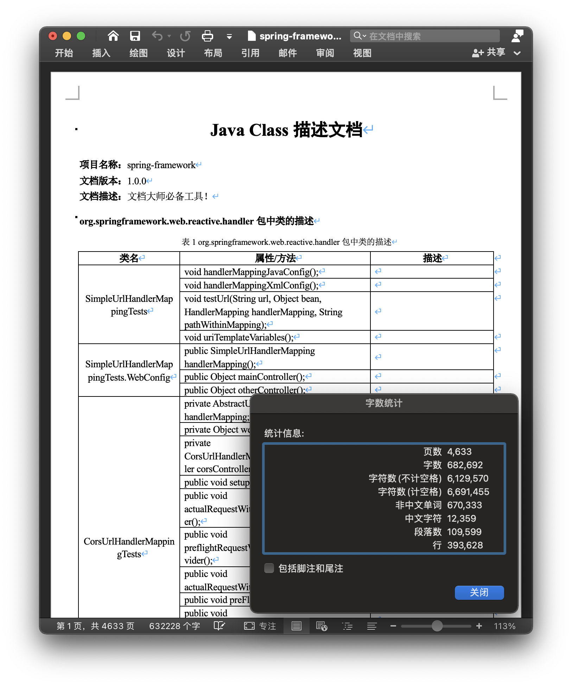

## 简介

最近写毕设论文，发现一件很奇怪的事情，要求将每个类的字段和方法签名以及对应的解释写在表格里，类似下面的图片，大胆猜测一下，这会不会是判断系统功能丰富程度的依据？如果我有几百个类，像这么一行一行去 copy，，，若是我只 copy 一部分，那会不会显得我的项目过于简单 ?🤯? 这种无用又无趣纯属浪费粮食的事情我是完全不乐意做的，按往常的经验，在 copy 的时候我会头皮发麻浑身难受然后跑去打游戏，且不说光看这种表格能看出什么所以然，但凡有一点营养我都不会写这个工具。但愿人长久，搬砖不再有。此乃文档大师必备工具！

灵感来自[screw](https://github.com/pingfangushi/screw)，其实我是在论文的数据库章节用了这个工具，然后到了项目代码章节，发觉我也可以让电脑来帮我写，论文真是太坏了，竟然让电脑当苦力！

## 功能

- 支持生成大型 Java 项目、多个项目、多个模块、单个类
- 支持自定义模板
- 支持显示或隐藏访问修饰符
- 支持保留或忽略没有 JavaDoc 注释的字段、方法、类
- 支持按包名、类名、字段名、方法名的前缀、后缀来忽略生成

当然前提是类中的字段或方法有 JavaDoc `/** */`，而不是单行注释`//`或多行注释`/* */`，否则将不会生成字段/方法的描述

P.s. 即使是不能通过编译的 Java Class 也可以生成，只要有 `.java` 文件即可

## 文档生成支持

- [x] Word
- [ ] HTML
- [ ] Markdown

WIP

## 文档截图

- Word


- HTML

WIP

- Markdown

WIP


下图是[spring-framework](https://github.com/spring-projects/spring-framework)项目代码生成的 word 文档，总大小 164 MB，耗时 70s ，讲道理很庞大的项目应该也没问题

<sub>（我已经把生成的四千页贴进论文里了，老师很喜欢，孩子很开心!）</sub>



## 使用方法

### CLI

目前推荐此方式，下载[Releases](https://github.com/Naccl/Java2Doc/releases)中的 Java2Doc.jar，通过 CLI 调用，已测试 JDK 8、11 可用，16、17 不太行

```sh
java -jar Java2Doc-x.y.z.jar -p /Users/naccl/Desktop/YourProject
```

具体参数：

```sh
usage: java -jar Java2Doc-x.y.z.jar -p path1[;path2;path3;...] [-n <projectname>] [-v <version>] [-d <desc>] [-o
            <outputdir>] [-f <filename>] [-t <doctype>]
    --access-modifier <true/false>           Display access modifier, default is true
    --custom-template <path>                 Custom template path
 -d,--description <desc>                     The description of your project
    --engine-type <type>                     Template engine type, can be 'freemarker'
 -f,--filename <name>                        Document file name, default is 'Java2Doc'
 -h,--help                                   This usage help
    --ignore-class-prefix <prefixlist>       The ignore list of class prefix, separated by ';'
    --ignore-class-suffix <suffixlist>       The ignore list of class suffix, separated by ';'
    --ignore-empty-class <true/false>        Ignore classes without field and method, default is false
    --ignore-error <true/false>              Ignore errors in parsing JavaDoc, default is true
    --ignore-field-prefix <prefixlist>       The ignore list of field prefix, separated by ';'
    --ignore-field-suffix <suffixlist>       The ignore list of field suffix, separated by ';'
    --ignore-method-prefix <prefixlist>      The ignore list of method prefix, separated by ';'
    --ignore-method-suffix <suffixlist>      The ignore list of method suffix, separated by ';'
    --ignore-nocomment-field <true/false>    Ignore fields without comment, default is false
    --ignore-nocomment-method <true/false>   Ignore methods without comment, default is false
    --ignore-pkg-prefix <prefixlist>         The ignore list of package prefix, separated by ';'
    --ignore-pkg-suffix <suffixlist>         The ignore list of package suffix, separated by ';'
    --include-private <true/false>           Parsing JavaDoc includes private classes and members, default is true
    --max-depth <number>                     The maximum depth to traverse a directory starting from project path
 -n,--project-name <name>                    The name of your project
 -o,--output-dir <path>                      Document output directory, default is current directory
 -p,--project-paths <pathlist>               The list of project paths you want to generate, separated by ';'
 -t,--doctype <type>                         Document type, can be 'word', 'html', 'md', default is 'word'
 -v,--version <version>                      The version of your project
```

### Clone

```sh
git clone https://github.com/Naccl/Java2Doc.git
```

建议 JDK 8，解析 JavaDoc 依赖的 `tools.jar` 从 JDK 9+ 开始已经被移除了，虽说我已经使用在 `pom.xml` 中使用本地仓库了，但还是不确定高版本是否可用

修改 `Main.java` 中的基本配置信息

```java
//待生成的项目根路径列表
projectPaths.add("/Users/naccl/work/idea-project/Java2Doc");
//项目名称
String projectName = "Java2Doc";
//文档版本
String version = "1.0.0";
//文档描述
String description = "文档大师必备工具！";
//文档输出目录
String fileOutputDir = "/Users/naccl/Desktop";
//生成文档名称
String fileName = "Java2Doc";
//生成文档类型 DocumentType.WORD、DocumentType.HTML、DocumentType.MARKDOWN
DocumentType documentType = DocumentType.WORD;
```

然后直接 Run 它！

如果你配置过 Maven 镜像仓库，且 Maven 的配置文件（通常是`~/.m2/settings.xml` ）中对应镜像的 `mirrorOf` 是 `*`，那么 `pom.xml` 中配置的 repository 将不起作用，需要改为

```xml
<mirrorOf>external:*</mirrorOf>
```

只让外部仓库的走镜像，本地的继续走本地

### Maven

WIP......<sub>（等我写完论文🥵）</sub>

## 已知问题

由于 Java 类中的字段注释、方法注释是通过调用 `com.sun.tools` 解析 JavaDoc 获取的，JavaDoc 有个参数 `-classpath` 可以指定加载要解析的 Java 类中 import 的包。但往往项目需要的依赖相当多，并且通常是 Maven、Gradle 方式来引入依赖，难以全部作为 `-classpath` 的值提供给 JavaDoc 解析器，所以会导致一些自定义类的泛型解析结果为 `<any>` ，本项目中的做法是将这些 `<any>` 替换成 `T` 来显示，尚不知是否有更好的办法。

## 参与贡献

- 文档格式

  除了 Word、HTML、Markdown，或许还有其它可以实现的格式

- 模板样式

  每个人可能有不同的样式需求，一般都需要编写专门的模板，大伙们可以分享自己的模板

- 模板引擎

  其它的模板引擎实现，如 thymeleaf、velocity

欢迎 PR！

## License

[Apache-2.0 License](https://github.com/Naccl/Java2Doc/blob/master/LICENSE)

## Thanks

再次感谢[screw](https://github.com/pingfangushi/screw)，项目实现过程中参考了screw的设计思路
